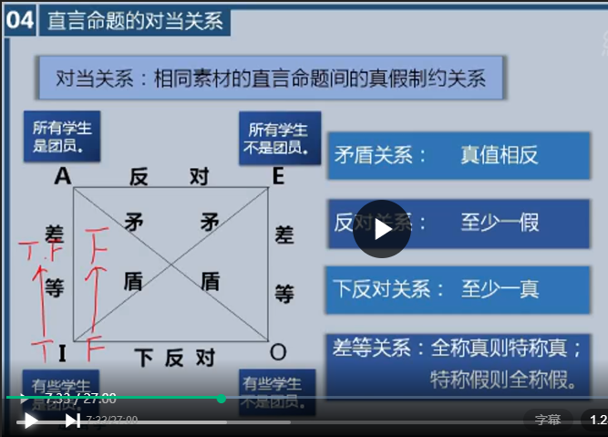
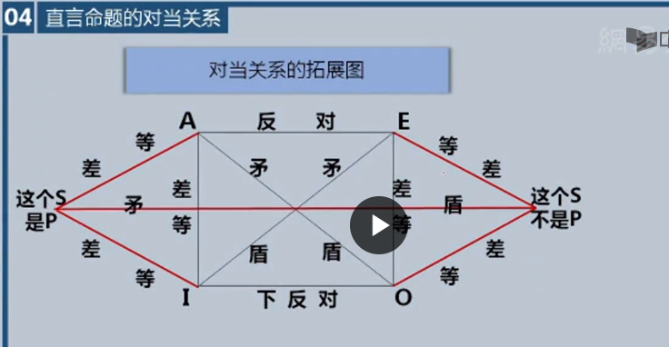

## 对当关系：相同素材的直言命题间的真假制约关系

  - 直言命题的关系中，一个直言命题的真假可以制约另外一个直言命题
  
  - 四种命题类型构成的逻辑 **方阵图**
    

    - A命题-SAP：所有学生都是团员
    - E命题-SEP：所有学生不是团员
    - I命题-SIP：有些学生是团员
    - O命题-SOP：有些学生不是团员

    - A、O之间的关系：A命题真，O命题一定假 A、O之间真假值相反；**矛盾关系**：真值相反；*E、I之间同理*；
    - A、E之间的关系：A命题真，E命题一定假；A命题为假，E两种情况，可真可假，A命题假不能推出E命题的真假；**反对关系**：至少一假；A、E之间可以由真推假，不能由假推真；
    - I、O之间的关系：I命题真，O命题可真可假；I命题假，O命题则为真；**下反对关系**：至少一假；I、O之间可以由假推真，不能由真推假；
    - A、I之间的关系：A命题真，I命题真；A命题假，I命题可真可假；I命题真，A命题可真可假；I命题假，A命题假；**差等关系**：全称真则特称真，特称假则全称假；全称的真可以推出特称的假，全称的假什么也推不出；*E、O之间同理*

### 对当关系的注意事项
  - 对当关系是同素材的四种直言命题之间的真假关系（同素材：指的是主项相同，谓项也相同）
  - 直言命题间的反对关系、下反对关系和差等关系，都以主项存在预设为先决条件（存在预设：不能是空概念）
  - 矛盾关系优先原则
  - 不就当把根据对当关系推出的直言命题的真值与命题实际具有的真值简单地划等号

### 单称命题和直言命题的关系
  

  - 这个S是P，这个S不是P：单称肯定命题与单称否定命题之间是矛盾关系
  - 单称肯定命题与A命题和I命题这个三角之间构成了差等关系
  - 单称否定命题与E命题和O命题这个三角之间构成了差等关系

      